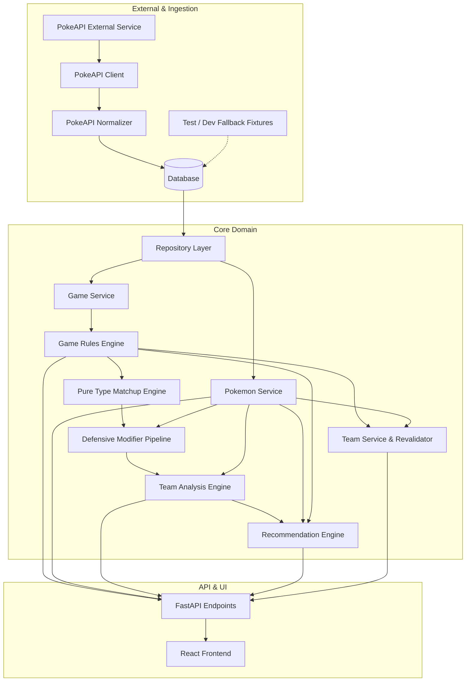
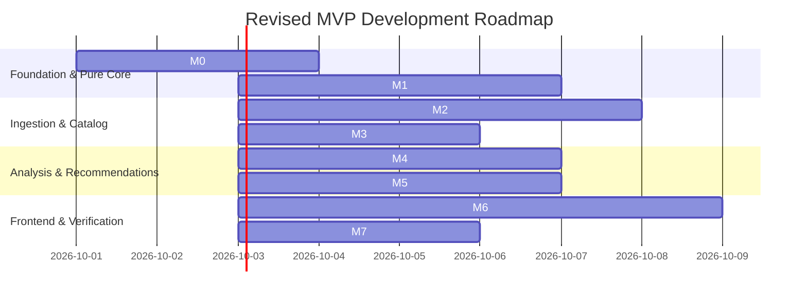

# PokeDex TeamTypeMatchup - Technical Implementation Plan

**Document Version:** 1.1.0  
**Status:** Approved with Revisions / Ready for Milestone Execution  
**Source of Truth:** [docs/requirements.md](file:///c:/Users/USER/OneDrive/Pictures/PokeDex%20teamTypeSetup/docs/requirements.md)  
**Target Delivery:** Minimum Viable Product (MVP)

---

## 1. Requirements Analysis & Architectural Foundations

### 1.1 Core Mission & Architectural Axiom
PokeDex TeamTypeMatchup is an advisory Pokémon team-building and matchup analysis tool governed by a foundational architectural axiom: **Game Context is an essential input, never an afterthought.**

> **Core System Rule (Section 6):**  
> *"The application should not answer a game-dependent question about what a Pokémon, Ability, move or team does without first knowing which supported game rules apply."*

Every domain query—availability, typing, base stats, ability effects, type matchups, and team recommendations—executes strictly through the lens of a resolved `GameRuleProfile`. Under no circumstances may mechanics, type charts, or Pokémon availability leak across generational or game boundaries.

### 1.2 Functional Requirements (SRS Traceability Matrix)

| ID | Requirement | MVP Implementation Scope |
| :--- | :--- | :--- |
| **FR-01** | Game Selection | Player must choose a specific supported Pokémon game before executing game-dependent operations. |
| **FR-02** | Game Context | The active `game_id` is maintained in the application session and passed with every backend request. |
| **FR-03** | Rule Profile | Backend resolves a `GameRuleProfile` defining active type chart, generation, and mechanic flags. |
| **FR-04** | Game Availability | Catalog queries filter exclusively to Pokémon available in the selected game. |
| **FR-05** | Pokémon Search | Search by name, type, and index within the bounds of the active game. |
| **FR-06** | Pokémon Details | Display game-accurate primary/secondary types, valid abilities, and generation base stats. |
| **FR-07** | Ability Versioning & Modifiers | Display versioned ability text. Defensive type-altering abilities are evaluated via a decoupled **Defensive Modifier Pipeline** outside the pure type engine. |
| **FR-08** | Move Mechanics | *Scoped for MVP:* Evaluated via potential **STAB Type Coverage** based on typing. Equipped move-set analysis is deferred to a post-MVP proposal. |
| **FR-09** | Type Matchup Engine | Pure, independently testable domain engine calculating strict type-vs-type interactions ($0\times, 0.25\times, 0.5\times, 1\times, 2\times, 4\times$) under the active game's type chart. |
| **FR-10** | Team Creation | Maintain a roster of up to six (6) Pokémon valid in the selected game. |
| **FR-11** | Team Editing | Add, remove, swap, and mark an "Anchor Pokémon" in the roster. |
| **FR-12** | Team Analysis | Calculate aggregate defensive type profile across all types for the active generation. |
| **FR-13** | Weakness Detection | Flag incoming attacking types that deal $\ge 2\times$ super-effective damage to 2 or more team members. |
| **FR-14** | STAB Type Coverage & Gap Detection | Identify team unresisted defensive gaps and evaluate offensive **STAB Type Coverage** based on Pokémon typing. (Does *not* evaluate equipped moves). |
| **FR-15** | Candidate Suggestions | Query game-valid Pokémon that resist the team's shared weaknesses and plug defensive gaps. |
| **FR-16** | Recommendation Explanation | Present explicit, deterministic rationale (e.g., *"Resists Ground (0.5x) and Rock (0.5x), which threaten 3 of your current members"*). |
| **FR-17** | Less-Used / Anchor Support | Allow pinning an **"Anchor Pokémon"** that the recommender cannot replace or remove, building the team around it. |
| **FR-18** | Game Change Handling | When switching games, revalidate team: flag invalid Pokémon, detect altered types/abilities, prompt user to confirm replacements. |
| **FR-19** | Unsupported Game Handling | Fail closed with explicit HTTP 400 / domain error; never fallback to default or mixed rules. |
| **FR-20** | Team Persistence | Client-side `localStorage` caching of current team and active game ID; no user accounts required for MVP. |

### 1.3 Target Games for MVP (Cross-Generation Proof)
To satisfy the MVP Acceptance Criterion (*"demonstrate at least one mechanic whose treatment differs between two supported game profiles"*), the MVP will initially support two distinct game releases:
1. **Game A:** *Pokémon FireRed / LeafGreen* (Generation III)
   - 17 types (No Fairy type).
   - Steel resists Ghost and Dark.
   - Magnemite/Magneton are Electric/Steel.
   - Standard Gen III base stats and ability pool.
2. **Game B:** *Pokémon X / Y* (Generation VI)
   - 18 types (Fairy introduced; Normal/Fairy Jigglypuff, etc.).
   - Steel loses resistance to Ghost and Dark.
   - Clefairy becomes pure Fairy; Togepi line becomes Fairy/Flying.
   - Gen VI base stat updates (e.g., Pidgeot +10 Speed).

---

## 2. Component Architecture for the MVP

```
+-----------------------------------------------------------------------------------------+
|                                 FRONTEND (React + TS)                                   |
|  +---------------------+  +----------------------+  +--------------------------------+  |
|  | GameSelectorContext |  | TeamBuilderState     |  | PokédexCatalogUI               |  |
|  +----------+----------+  +----------+-----------+  +---------------+----------------+  |
|             |                        |                              |                   |
|  +----------v------------------------v------------------------------v----------------+  |
|  |                      ApiClient (Axios / Fetch + TanStack Query)                   |  |
+------------------------------------------+----------------------------------------------+
                                           | HTTP / REST (Always includes ?game_id)
+------------------------------------------v----------------------------------------------+
|                                 BACKEND (FastAPI)                                       |
|  +-----------------------------------------------------------------------------------+  |
|  | API Routing & Request Validation (Pydantic schemas with game_id enforcement)       |  |
|  +---------------------------------------+-------------------------------------------+  |
|                                          |                                              |
|  +---------------------------------------v-------------------------------------------+  |
|  | GameContextMiddleware / GameContextResolver                                       |  |
|  +---------------------------------------+-------------------------------------------+  |
|                                          |                                              |
|         +--------------------------------+-------------------------------+              |
|         |                                |                               |              |
|  +------v---------------+      +---------v----------+      +-------------v-----------+  |
|  | Game Rules Engine    |      | Pokémon Service    |      | Team Service            |  |
|  | (Independent Core)   |      | (Game Catalog)     |      | (CRUD & Reval)          |  |
|  +------+---------------+      +---------+----------+      +-------------+-----------+  |
|         |                                |                               |              |
|         |                      +---------v-------------------------+     |              |
|         +--------------------->| Pure Type Matchup Engine          |<----+              |
|         |                      | (Strict type-vs-type math only)   |                    |
|         |                      +-----------------+-----------------+                    |
|         |                                        |                                      |
|         |                      +-----------------v-----------------+                    |
|         +--------------------->| Defensive Modifier Pipeline       |                    |
|         |                      | (Levitate, Flash Fire, etc.)      |                    |
|         |                      +-----------------+-----------------+                    |
|         |                                        |                                      |
|         |                      +-----------------v-----------------+                    |
|         +--------------------->| Team Analysis Engine              |                    |
|                                | (Defensive Matrix + STAB Coverage)|                    |
|                                +-----------------+-----------------+                    |
|                                                  |                                      |
|                                +-----------------v-----------------+                    |
|                                | Recommendation Engine (Rule-based)|                    |
|                                +-----------------+-----------------+                    |
|                                                  |                                      |
|  +-----------------------------------------------v-----------------------------------+  |
|  | Data Access Layer (SQLAlchemy ORM + Repository Pattern)                           |  |
|  +-----------------------+-----------------------------------------------------------+  |
+--------------------------|--------------------------------------------------------------+
                           |
+--------------------------v--------------------------------------------------------------+
|               EXTERNAL INGESTION & DATA NORMALIZATION LAYER                             |
|  +------------------------------------+      +---------------------------------------+  |
|  | PokeAPI Client & Adapter           |      | Fallback & Test Fixtures              |  |
|  | - Fetches raw PokeAPI JSON         |      | - Curated JSON fixtures               |  |
|  | - PokeApiDataNormalizer maps into  |      | - Deterministic unit tests & offline  |  |
|  |   internal Domain / ORM Models     |      |   dev environment setup               |  |
|  +-----------------+------------------+      +-------------------+-------------------+  |
+--------------------|---------------------------------------------|----------------------+
                     |                                             |
                     +----------------------+----------------------+
                                            |
+-------------------------------------------v---------------------------------------------+
|                   DATABASE (PostgreSQL / SQLite Seeded Catalog)                         |
|  games | game_rule_profiles | types | type_effectiveness | pokemon |                   |
|  game_pokemon | pokemon_types | abilities | ability_versions | base_stats               |
+-----------------------------------------------------------------------------------------+
```

### Component Breakdown & Design Contracts

1. **PokeAPI Adapter & Normalization Service (`backend/app/adapters/pokeapi/`)**:
   - Primary external Pokémon data source for the application.
   - `PokeApiClient`: Handles external HTTP communication, rate limiting, and raw response caching.
   - `PokeApiDataNormalizer`: Transforms external PokeAPI response structures into internal domain/ORM models (`Pokemon`, `PokemonType`, `Ability`, `BaseStat`).
   - **Isolation Guarantee:** The rest of the backend and frontend **never** references or depends upon PokeAPI's internal schema. All internal services consume normalized internal domain entities.

2. **Deterministic Test & Fallback Fixtures (`backend/tests/fixtures/`)**:
   - Curated JSON datasets representing FireRed/LeafGreen and X/Y.
   - Used strictly for fast, reproducible offline unit/integration tests and development environments without network dependencies. Not a substitute for the PokeAPI ingestion pipeline.

3. **Game Rules Engine (`backend/app/engines/rules_engine.py`)**:
   - Pure domain component decoupled from UI, HTTP, and data-fetching frameworks.
   - Maps `game_id` $\to$ `ResolvedGameRules` (type chart version, generation, active mechanics, type list).

4. **Pure Type Matchup Engine (`backend/app/engines/matchup_engine.py`)**:
   - Strictly responsible for **type-vs-type interactions**.
   - Pure mathematical calculations for single-type ($1 \times 1$) and dual-type ($1 \times 2$) matchups:
     $$\text{Multiplier} = \text{Chart}[T_{\text{atk}}, T_{\text{def1}}] \times \text{Chart}[T_{\text{atk}}, T_{\text{def2}}]$$
   - Does not contain ability logic, item logic, or battle state.

5. **Defensive Modifier Pipeline (`backend/app/engines/modifiers/`)**:
   - Separate, extensible abstraction that adjusts base type multipliers based on non-type factors.
   - Implements a clear interface:
     ```python
     class DefensiveModifier(Protocol):
         def apply(self, attacking_type: str, base_multiplier: float, context: ModifierContext) -> float: ...
     ```
   - Initial MVP modifiers:
     - `LevitateModifier`: Sets Ground multiplier to $0.0\times$.
     - `FlashFireModifier`: Sets Fire multiplier to $0.0\times$.
     - `WaterAbsorbModifier`: Sets Water multiplier to $0.0\times$.
     - `VoltAbsorbModifier`: Sets Electric multiplier to $0.0\times$.
     - `ThickFatModifier`: Reduces Fire and Ice multipliers by $50\%$ ($0.5\times$).
   - Designed to seamlessly support future battle items (e.g., *Air Balloon*) or weather modifiers without altering the pure Type Matchup Engine.

6. **Team Analysis Engine (`backend/app/engines/team_analysis_engine.py`)**:
   - Aggregates team defensive profile (6 Pokémon $\times$ active types) combining pure type matchup calculations and active defensive modifiers.
   - Identifies repeated weaknesses ($\ge 2$ members vulnerable to the same attacking type).
   - Identifies team defensive gaps (attacking types where 0 members have resistance or immunity).
   - Evaluates **STAB Type Coverage**: Calculates the union of all primary and secondary types on the team to identify offensive super-effective potential (does *not* evaluate equipped moves).

7. **Deterministic Recommendation Engine (`backend/app/engines/recommendation_engine.py`)**:
   - Evaluates available candidates in the active game.
   - Filters candidates that resist or nullify the team's top repeated weaknesses.
   - Penalizes candidates that duplicate existing severe team vulnerabilities.
   - **Anchor Pokémon Guarantee:** If an "Anchor Pokémon" is designated, the recommender treats it as an immutable constraint, building around it without suggesting its replacement.
   - Generates transparent, human-readable rationale cards.

8. **Team Management & Revalidation Service (`backend/app/services/team_service.py`)**:
   - Manages team state and executes revalidation when `game_id` switches:
     - Flags unavailable species in target game.
     - Flags altered types (e.g., Clefairy Normal $\to$ Fairy in Gen VI).
     - Flags altered or missing abilities between games.

---

## 3. Component Dependencies & Data Flow



### Dependency Contracts:
1. **Decoupled PokeAPI Dependency:** `PokeApiClient` and `PokeApiDataNormalizer` are isolated in the adapter layer. No service or engine imports or interacts with PokeAPI raw payloads.
2. **Pure Matchup Engine Isolation:** `TypeMatchupEngine` operates on primitive type identifiers and the resolved `TypeChartMatrix`. It has no knowledge of abilities, Pokémon entities, or database models.
3. **Pluggable Defensive Modifiers:** The `DefensiveModifierPipeline` wraps type effectiveness and can be toggled or extended without modifying the underlying type chart or pure matchup engine.
4. **STAB Coverage Clarification:** Team analysis and recommendations calculate offensive coverage exclusively via the Pokémon's native types (**STAB Type Coverage**).

---

## 4. MVP Development Milestones



---

## 5. Detailed Implementation Tasks

### Milestone 0: Environment Setup & Core Scaffolding
- [ ] **Task 0.1: Backend Initialization**
  - Initialize Python virtual environment with `uv` or `poetry`.
  - Install FastAPI, Uvicorn, SQLAlchemy 2.0, Pydantic v2, HTTPX, and Pytest.
  - Setup linting and formatting (`ruff`).
- [ ] **Task 0.2: Frontend Initialization**
  - Scaffold React + TypeScript project with Vite inside `frontend/`.
  - Install TailwindCSS, Lucide-React icons, and TanStack Query (`@tanstack/react-query`).
- [ ] **Task 0.3: Database Setup**
  - Setup SQLite for local development and test reproducibility (PostgreSQL ready via SQLAlchemy URL).
  - Configure Alembic for schema migrations.

### Milestone 1: Pure Type Matchup Engine & Defensive Modifier Pipeline
- [ ] **Task 1.1: Core Domain Dataclasses**
  - Create `backend/app/models/domain.py`: `GameRuleProfile`, `TypeChartMatrix`, `TypeMultiplier`, `DefensiveMatchup`.
- [ ] **Task 1.2: Pure Type Matchup Engine**
  - Implement `calculate_pure_matchup(attacker_type: str, defender_types: list[str], type_chart: TypeChartMatrix) -> float`.
  - Zero ability, item, or status dependencies.
- [ ] **Task 1.3: Defensive Modifier Pipeline & Plugin Architecture**
  - Define `DefensiveModifier` protocol and `ModifierContext` (holding defender ability, active game rules).
  - Implement initial ability modifiers:
    - `LevitateModifier` (Ground immunity).
    - `FlashFireModifier` (Fire immunity).
    - `WaterAbsorbModifier` (Water immunity).
    - `VoltAbsorbModifier` (Electric immunity).
    - `ThickFatModifier` (50% reduction to Fire/Ice).
  - Implement `DefensiveModifierPipeline.apply(...)` to chain modifiers after the pure type matchup calculation.
- [ ] **Task 1.4: Unit Test Suite for Matchup Engine & Modifiers**
  - Unit tests for pure type interactions (e.g., Metagross vs Dark/Ghost: $0.5\times$ in Gen III vs $1.0\times$ in Gen VI; Charizard vs Rock: $4.0\times$).
  - Unit tests for modifier application (e.g., Gengar with Levitate vs Ground: $0.0\times$; Snorlax with Thick Fat vs Ice: $0.5\times$).

### Milestone 2: PokeAPI Ingestion Adapter & Normalized Database Layer
- [ ] **Task 2.1: Relational Schema Definition**
  - Implement SQLAlchemy models:
    - `generations` (`id`, `number`, `name`)
    - `games` (`id`, `title`, `generation_id`, `version_group`, `is_supported`)
    - `game_rule_profiles` (`game_id`, `type_chart_version`, `has_fairy_type`, `steel_resists_dark_ghost`)
    - `types` (`id`, `name`)
    - `type_chart_entries` (`chart_version`, `attacker_type_id`, `defender_type_id`, `multiplier`)
    - `pokemon` (`id`, `dex_number`, `name`, `species_name`, `form_name`)
    - `game_pokemon` (`game_id`, `pokemon_id`, `is_available`)
    - `pokemon_types` (`pokemon_id`, `game_id_or_version_group`, `type_id`, `slot`)
    - `abilities` (`id`, `name`)
    - `pokemon_abilities` (`pokemon_id`, `game_id_or_version_group`, `ability_id`, `is_hidden`)
    - `base_stats` (`pokemon_id`, `game_id_or_version_group`, `hp`, `atk`, `def`, `spa`, `spd`, `spe`)
- [ ] **Task 2.2: PokeAPI Client & Adapter**
  - Build `backend/app/adapters/pokeapi/client.py`:
    - Async HTTP client with retry and local JSON disk caching.
    - Endpoints consumed: `/pokemon/{id}`, `/pokemon-species/{id}`, `/generation/{id}`, `/version-group/{id}`.
- [ ] **Task 2.3: Data Normalization Service**
  - Build `backend/app/adapters/pokeapi/normalizer.py`:
    - Normalizes raw PokeAPI JSON into internal SQLAlchemy ORM entities.
    - Resolves game availability for FireRed/LeafGreen and X/Y based on PokeAPI `game_indices` and `version_group_details`.
- [ ] **Task 2.4: Deterministic Fallback & Test Fixtures**
  - Create curated JSON test fixtures in `backend/tests/fixtures/` for offline unit testing and development seed fallback.

### Milestone 3: Pokémon Catalog Service & Game Context API
- [ ] **Task 3.1: Pokémon Catalog Service**
  - Implement `get_games() -> list[Game]`.
  - Implement `search_pokemon(game_id: str, query: str, type_filter: str | None) -> list[PokemonSummary]`.
  - Implement `get_pokemon_details(game_id: str, pokemon_id: str) -> PokemonDetail` with game-accurate types, abilities, and base stats.
- [ ] **Task 3.2: FastAPI Endpoints**
  - `GET /api/v1/games`: List supported games.
  - `GET /api/v1/games/{game_id}/rules`: Return resolved rule profile.
  - `GET /api/v1/pokemon?game_id={id}&search={q}`: Game-filtered search.
  - `GET /api/v1/pokemon/{pokemon_id}?game_id={id}`: Detail retrieval.
- [ ] **Task 3.3: API Integration Tests**
  - Verify that `Sylveon` returns 404/Empty in `game_id=firered`, but succeeds in `game_id=pokemon_x`.
  - Verify `Clefairy` returns `Normal` in `firered` and `Fairy` in `pokemon_x`.

### Milestone 4: Team Builder, Defensive Analysis & STAB Type Coverage
- [ ] **Task 4.1: Team Domain Models & Session State**
  - Implement `TeamMember` (`pokemon_id`, `slot`, `is_anchor`, `chosen_ability_id`).
  - Implement `Team` (`id`, `game_id`, `members`: max 6).
- [ ] **Task 4.2: Team Defensive Analysis**
  - Calculate 6 members $\times$ $N$ attacking types matrix (using pure matchup + defensive modifier pipeline).
  - Weakness Detector: flag types where count(multiplier $> 1.0$) $\ge 2$.
  - Resistance Summary: count immunities ($0.0\times$) and resistances ($0.5\times, 0.25\times$).
  - Gaps: flag attacking types with zero resistors or immunities on the team.
- [ ] **Task 4.3: STAB Type Coverage Engine**
  - Calculate union of all primary and secondary types on the team.
  - Determine which attacking types the team can hit super-effectively via STAB.
  - Flag missing offensive STAB coverage types.
- [ ] **Task 4.4: Game Change Revalidation Service**
  - Revalidate team when switching `game_id`:
    - Detect unavailable Pokémon in `new_game_id`.
    - Detect altered typings, abilities, or stats.
- [ ] **Task 4.5: Team API Endpoints**
  - `POST /api/v1/teams/analyze`: Stateless analysis returning defensive matrix and STAB Type Coverage.
  - `POST /api/v1/teams/revalidate`: Takes `{ current_game_id, new_game_id, team: [...] }`.

### Milestone 5: Deterministic Recommendation Engine
- [ ] **Task 5.1: Rule-Based Candidate Scoring**
  - Filter: Candidate must have `is_available == True` in `game_id` and not be on the active team.
  - Gap Relief Score: Award points if candidate resists ($0.5\times, 0.25\times$) or nullifies ($0.0\times$) team weaknesses.
  - Vulnerability Penalty: Deduct points if candidate adds duplicate severe weaknesses ($\ge 2\times$).
  - STAB Expansion Bonus: Award points if candidate introduces a new STAB attacking type that covers unhandled defensive matchups.
  - **Anchor Protection:** Pinned anchor Pokémon cannot be suggested for replacement.
- [ ] **Task 5.2: Natural-Language Rationale Generator**
  - Output explicit, bulleted rationale for each candidate (e.g., *"Resists Ground (0.5x) which threatens Charizard and Raichu"*).
- [ ] **Task 5.3: Recommendation API Endpoint**
  - `POST /api/v1/teams/recommendations`: Stateless endpoint returning top 5 candidates with structured rationale cards.

### Milestone 6: Frontend Client Implementation
- [ ] **Task 6.1: Global Game Context & Shell**
  - Setup `GameContext` provider with active game selector.
  - Build persistent top navigation with active Game Badge and switcher.
- [ ] **Task 6.2: Pokédex Search & Pokémon Card Component**
  - Search input with debounce; grid display with game-appropriate types and stats.
  - "Add to Team" action button.
- [ ] **Task 6.3: Team Builder Roster UI**
  - Six slot layout (empty slot placeholders, filled slots with sprite, name, types).
  - Slot actions: Remove, Move, and **"Pin as Anchor"** toggle.
- [ ] **Task 6.4: Team Analysis & STAB Type Coverage UI**
  - Defensive type effectiveness chart (color-coded badges: 4x, 2x, 1x, 0.5x, 0.25x, 0x).
  - "Severe Vulnerabilities" warning callout ($\ge 2$ members weak).
  - **"STAB Type Coverage"** panel showing offensive coverage and missing offensive STAB types.
- [ ] **Task 6.5: Suggestions & Recommendations View**
  - Candidate cards showing recommended Pokémon and rule-based explanations.
  - "Quick Add" to empty slot or replacement preview (protecting Anchor).
- [ ] **Task 6.6: Game Switcher Revalidation Modal**
  - Warning modal when switching games: lists any Pokémon that will be removed or altered.
- [ ] **Task 6.7: LocalStorage Persistence**
  - Save `selected_game_id` and `team_slots` to browser storage.

### Milestone 7: Verification, Cross-Game Testing & Documentation
- [ ] **Task 7.1: Automated Cross-Game Test Suite**
  - Execute end-to-end tests validating different team analysis results for the same Pokémon across Gen III vs Gen VI.
- [ ] **Task 7.2: Accessibility & Usability Review**
  - Ensure type badges use both colors and text labels.
  - Keyboard navigation for search and modal dialogs.
- [ ] **Task 7.3: User Documentation & Walkthrough**
  - Create setup and usage guide in `docs/WALKTHROUGH.md`.

---

## 6. Technical Risks & Ambiguities Analysis

| Area | Ambiguity / Risk | Severity | Mitigation Strategy |
| :--- | :--- | :--- | :--- |
| **PokeAPI Ingestion & Rate Limits** | External API rate limiting, network latency, or payload changes could impact system reliability. | **MEDIUM** | Build an isolated `PokeApiClient` with disk-based response caching and an explicit `PokeApiDataNormalizer`. Maintain offline JSON fixtures in `backend/tests/fixtures/` for test suites. |
| **Defensive Modifier Extensibility** | Blurring type calculations with abilities, items, or weather risks making the matchup engine brittle. | **LOW** | Keep the `TypeMatchupEngine` strictly pure (type-vs-type only). Chain all non-type defensive adjustments through a decoupled `DefensiveModifierPipeline` using a pluggable interface. |
| **STAB Coverage vs Move Analysis** | Confusion between equipped move coverage and base typing potential could cause scope creep. | **LOW** | Formally define and label MVP feature as **"STAB Type Coverage"** derived strictly from Pokémon native typing. Equipped move-set analysis is documented as a post-MVP proposal. |
| **Anchor Pokémon Definition** | Unclear definition of "less-used" Pokémon. | **LOW** | Solved deterministically via the **"Anchor Pokémon"** mechanic: the user designates any chosen Pokémon as an anchor; the recommendation engine builds around it without scoring or replacing it based on popularity tiers. |

---

## 7. Proposed Repository Structure

```text
PokeDex teamTypeSetup/
├── docs/
│   ├── requirements.md               # Source of truth specification
│   ├── IMPLEMENTATION_PLAN.md        # This document
│   └── architecture/                 # Architectural diagrams and schema specs
│
├── backend/
│   ├── pyproject.toml                # Dependencies & tool configs (Ruff, Pytest, HTTPX)
│   ├── README.md                     # Backend setup & execution instructions
│   ├── app/
│   │   ├── __init__.py
│   │   ├── main.py                   # FastAPI app entry point & CORS configuration
│   │   ├── core/
│   │   │   ├── config.py             # App settings & environment variables
│   │   │   └── errors.py             # Custom domain exceptions
│   │   ├── models/
│   │   │   ├── domain.py             # Pure domain models (TypeChart, RuleProfile)
│   │   │   ├── orm.py                # SQLAlchemy relational database entities
│   │   │   └── schemas.py            # Pydantic request/response schemas
│   │   ├── adapters/
│   │   │   └── pokeapi/              # Dedicated PokeAPI ingestion adapter
│   │   │       ├── __init__.py
│   │   │       ├── client.py         # HTTP client with rate-limiting & caching
│   │   │       ├── normalizer.py     # Maps PokeAPI JSON to internal Domain/ORM models
│   │   │       └── schemas.py        # Typed representation of external PokeAPI responses
│   │   ├── engines/
│   │   │   ├── __init__.py
│   │   │   ├── rules_engine.py       # Game Rules Engine (Independent Core)
│   │   │   ├── matchup_engine.py     # Pure Type Matchup Engine (Strict type-vs-type)
│   │   │   ├── modifiers/            # Decoupled defensive modifiers
│   │   │   │   ├── __init__.py
│   │   │   │   ├── base.py           # DefensiveModifier protocol
│   │   │   │   ├── ability_modifiers.py # Levitate, Flash Fire, Thick Fat, etc.
│   │   │   │   └── pipeline.py       # Pipeline chaining modifiers after pure matchup
│   │   │   ├── team_analysis_engine.py # Team defensive matrix & STAB Type Coverage
│   │   │   └── recommendation_engine.py # Deterministic recommendation engine
│   │   ├── services/
│   │   │   ├── game_service.py       # Game catalog & metadata
│   │   │   ├── pokemon_service.py    # Game-filtered catalog queries
│   │   │   └── team_service.py       # Team CRUD & game-change revalidator
│   │   ├── api/
│   │   │   └── v1/
│   │   │       ├── router.py         # Main V1 API router
│   │   │       ├── games.py          # /api/v1/games endpoints
│   │   │       ├── pokemon.py        # /api/v1/pokemon endpoints
│   │   │       └── teams.py          # /api/v1/teams endpoints
│   │   └── db/
│   │       ├── session.py            # Database session factory
│   │       └── seed_runner.py        # Database population script (calls adapter or fixtures)
│   └── tests/
│       ├── conftest.py
│       ├── fixtures/                 # Deterministic JSON test & dev fallback fixtures
│       │   ├── type_charts.json
│       │   ├── games.json
│       │   └── pokemon_fixtures.json
│       ├── test_rules_engine.py      # Independent tests for rule resolution
│       ├── test_matchup_engine.py    # Pure unit tests for type calculations (no abilities)
│       ├── test_modifiers.py         # Tests for Levitate, Thick Fat, etc.
│       ├── test_pokeapi_adapter.py   # Tests for PokeAPI normalization
│       ├── test_team_analysis.py     # Team defensive matrix & STAB coverage tests
│       ├── test_recommendations.py   # Deterministic recommendation & anchor tests
│       └── test_cross_game_diff.py   # Proves mechanic divergence (Gen 3 vs 6)
│
└── frontend/
    ├── package.json
    ├── vite.config.ts
    ├── tsconfig.json
    ├── tailwind.config.js
    ├── index.html
    └── src/
        ├── App.tsx                   # Top-level application container
        ├── main.tsx
        ├── index.css
        ├── types/                    # TypeScript interfaces matching backend schemas
        │   ├── game.ts
        │   ├── pokemon.ts
        │   ├── team.ts
        │   └── analysis.ts
        ├── services/
        │   └── api.ts                # Axios/Fetch client functions
        ├── context/
        │   ├── GameContext.tsx       # Global game context & provider
        │   └── TeamContext.tsx       # Team builder state & localStorage sync
        ├── components/
        │   ├── common/
        │   │   ├── TypeBadge.tsx     # Game-styled type pill (color + text)
        │   │   └── Modal.tsx
        │   ├── layout/
        │   │   ├── Navbar.tsx        # Top nav with active game indicator
        │   │   └── GameSelector.tsx  # Game picker modal / dropdown
        │   ├── pokedex/
        │   │   ├── PokemonCard.tsx
        │   │   ├── PokemonDetailModal.tsx
        │   │   └── SearchBar.tsx
        │   ├── team/
        │   │   ├── TeamSlot.tsx
        │   │   ├── TeamRoster.tsx
        │   │   └── AnchorBadge.tsx
        │   ├── analysis/
        │   │   ├── MatchupMatrix.tsx # Color-coded weakness/resistance chart
        │   │   ├── WeaknessAlerts.tsx
        │   │   ├── StabCoverage.tsx  # STAB Type Coverage visualization
        │   │   └── CoverageGaps.tsx
        │   └── recommendations/
        │       ├── CandidateCard.tsx
        │       └── ExplanationList.tsx
        └── pages/
            └── BuilderPage.tsx       # Unified team builder & analysis view
```

---

## 8. Immediate Next Steps & Recommended Execution Sequence

To execute the revised plan without external blocking factors:

1. **Phase 1: Pure Domain Engines (Milestone 1 - Tasks 1.1, 1.2, 1.3, 1.4)**
   - Build the `TypeMatchupEngine` strictly as a pure type-vs-type calculator.
   - Implement the `DefensiveModifierPipeline` and ability modifiers (`Levitate`, `FlashFire`, `WaterAbsorb`, `VoltAbsorb`, `ThickFat`).
   - Deliver Pytest test suite verifying pure matchups and modifier chaining.
2. **Phase 2: Database Schema & PokeAPI Normalization Adapter (Milestone 2 - Tasks 2.1, 2.2, 2.3, 2.4)**
   - Setup database models.
   - Build `backend/app/adapters/pokeapi/` with `client.py` and `normalizer.py`.
   - Setup fallback test fixtures in `backend/tests/fixtures/`.
3. **Phase 3: Catalog, Analysis & STAB Coverage Endpoints (Milestones 3 & 4)**
   - Expose game rules, Pokémon catalog search, defensive matrix analysis, and **STAB Type Coverage** via FastAPI.
4. **Phase 4: Frontend Game Selector & Team Builder Shell (Milestone 6)**
   - Build interactive React UI with game selector and 6-slot roster with anchor support.
